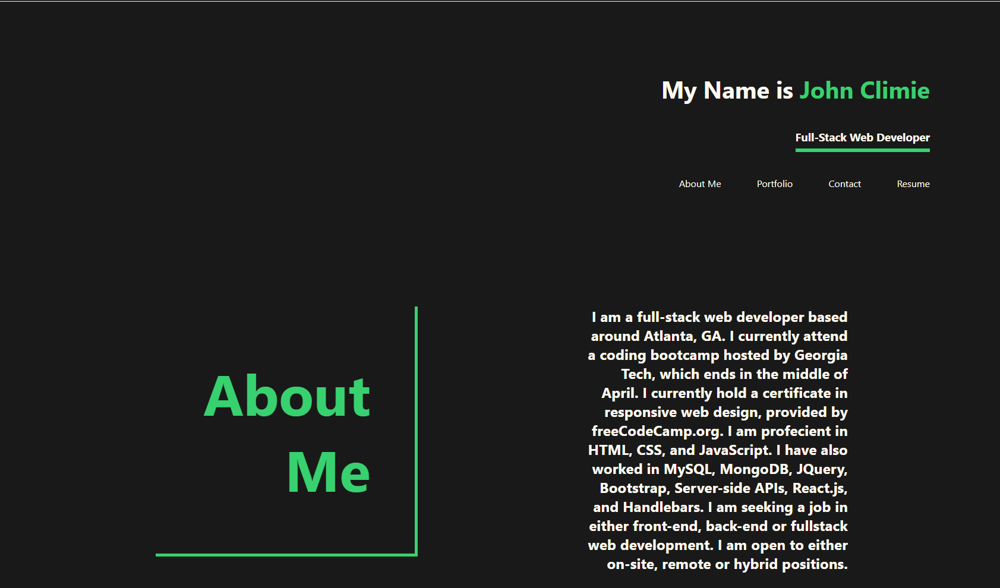

# React Portfolio

## Description

In this project, I created a front-end webpage using the JavaScript framework called React. This portfolio page is different from my last page due to enhanced looks and responsiveness. This webpage can be viewed from a variety of devices.

In order to view this project, you will simply have to go to the deployment link at the bottom of this README. A user can click on any navbar link and be taken to the about me page, portfolio, contact, or resume page. It's a fairly simple page which is easy to navigate.

This project was created from scratch, which required me to create a React application with the command `npx create-react-app`.

Overall, I found this project fairly simple. I was only challenged by how I was going to route to where it shows different componenets depending on what page is viewed. This is a beginner react project, however, I will get better overtime.

**Link**

GitHub Pages: https://johnclimie.github.io/ReactPortfolio/